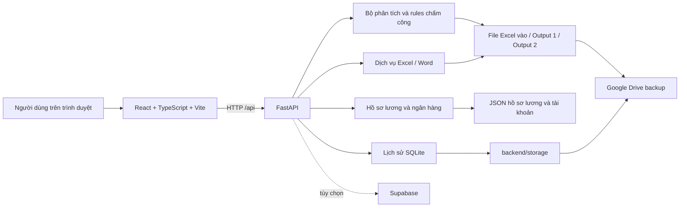
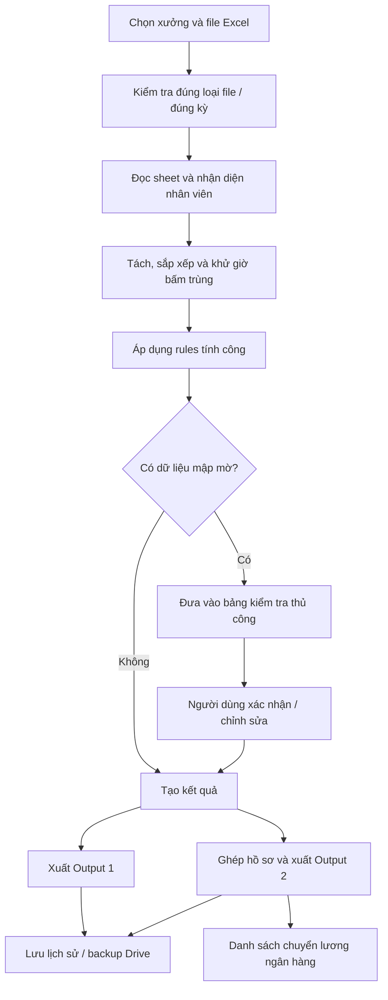

# BÁO CÁO NGÀY 8-5

> Báo cáo tổng quan đồ án **AttendanceSystem – Hệ thống xử lý và quản lý chấm công từ Excel**
>
> Ngày rà soát mã nguồn: **05/08/2026**
>
> Phạm vi: mã nguồn và trạng thái chạy thực tế tại thư mục `D:\AttendanceSystem`.

## 1. Tóm tắt đồ án

AttendanceSystem là ứng dụng nội bộ chạy trên Windows, dùng để biến file Excel thô xuất từ máy chấm công thành dữ liệu công và lương có thể kiểm tra, chỉnh sửa, lưu lịch sử và xuất lại. Hệ thống hỗ trợ hai mẫu dữ liệu **Xưởng 1** và **Xưởng 2**.

Giá trị chính của đồ án không chỉ là đọc Excel mà là chuẩn hóa quy trình nghiệp vụ:

1. Nhận diện đúng mẫu file và kỳ chấm công.
2. Tách dữ liệu theo mã nhân viên và từng ngày.
3. Đọc các mốc giờ vào/ra, loại bấm trùng và áp dụng rules ca làm.
4. Tính giờ công, phát hiện đi trễ, quên bấm và tình huống mập mờ.
5. Cho người dùng xác nhận hoặc sửa các trường hợp cần kiểm tra.
6. Xuất Output 1, Output 2, bảng lương và danh sách chuyển khoản ngân hàng.
7. Lưu lịch sử cục bộ; sao lưu file lên Google Drive; có thể dùng thêm Supabase.

Hệ thống đi theo nguyên tắc **tự động với trường hợp rõ ràng, yêu cầu con người xác nhận với trường hợp chưa đủ chắc chắn**. Đây là lựa chọn phù hợp vì dữ liệu này ảnh hưởng trực tiếp đến lương.

## 2. Chức năng hiện có

### 2.1. Chấm công

- Chọn Xưởng 1 hoặc Xưởng 2 và tải file Excel chấm công.
- Kiểm tra loại file trước khi phân tích, tránh dùng nhầm file thô, Output 1, Output 2 hoặc đảo hai file khi ánh xạ.
- Tự phát hiện sheet chấm công, tháng/năm, block nhân viên và mã nhân viên.
- Phân tích mốc giờ của từng ngày thành giờ công, số lần quên bấm, phút trễ và cảnh báo.
- Lưu workspace tạm để có thể tiếp tục công việc đang làm.
- Cho phép sửa thủ công kết quả và phân tích lại.
- Chỉ cho lưu/gửi khi các dòng cần kiểm tra đã được xác nhận.
- Xuất ảnh vùng Excel riêng cho từng nhân viên.

### 2.2. Hai loại file đầu ra

- **Output 1:** bảng chấm công đã được điền kết quả công, phần tổng hợp cơ bản và thông tin nhân viên.
- **Output 2:** Output 1 cộng vùng hồ sơ lương, công thức lương, thưởng, phạt, ứng lương, số tài khoản và tổng lương tháng.
- Có chức năng ánh xạ dữ liệu từ bản của chủ/bản kỳ trước vào file hiện tại theo **mã nhân viên và ý nghĩa tiêu đề cột**, không chỉ sao chép cứng theo tọa độ ô.
- File xuất giữ công thức Excel để người dùng còn có thể kiểm tra và sửa dữ liệu.

### 2.3. Hồ sơ lương

- Quản lý tên nhân viên, ngày bắt đầu làm, ghi chú, lương tháng/ngày/giờ, thưởng và khoản ứng/phạt.
- Hồ sơ được tách theo `factory1` và `factory2`; cùng một mã có thể có hồ sơ độc lập ở hai xưởng.
- Có đồng bộ hồ sơ từ **bản sao cuối cùng** nhưng không tùy tiện ghi đè hồ sơ sửa tay nếu chưa được xác nhận.

### 2.4. Lịch sử

- Lưu kỳ công theo xưởng, tháng và năm.
- Lưu file nguồn, Output 1, Output 2, dữ liệu tháng của nhân viên và chi tiết từng ngày.
- Tra cứu theo mã nhân viên/kỳ, sửa dữ liệu lịch sử và tải lại file.
- Tổng hợp số giờ, số ngày làm, lương và các cảnh báo đã lưu.

### 2.5. Ngân hàng

- Đọc Output 2 để lấy mã, tên, số ngày làm và lương cuối.
- Chỉ ưu tiên đưa người có công trong tháng vào danh sách chuyển lương.
- Quản lý danh bạ tài khoản riêng theo xưởng.
- Kiểm tra số tài khoản gồm 8–20 chữ số và phát hiện dữ liệu tài khoản xung đột.
- Nhập số tài khoản từ file Word và xuất danh sách chuyển lương dạng Word.
- Có sao lưu/khôi phục danh bạ qua thư mục Google Drive đã cấu hình.

### 2.6. Sao lưu và cloud

- Dữ liệu làm việc chính nằm trên máy: SQLite, JSON và các file lịch sử.
- Google Drive for desktop là hướng sao lưu mặc định.
- Có thể tạo bản sao Excel theo kỳ, bản sao cuối cùng và file ZIP sao lưu hệ thống.
- Supabase là tùy chọn nâng cao và đang tắt mặc định.
- Chức năng đăng nhập vai trò `owner/staff` có code sẵn nhưng hiện `ROLE_LOGIN_ENABLED = False`; app đang chạy dưới tài khoản owner cục bộ.

## 3. Kiến trúc và mô hình liên kết



### 3.1. Frontend

- Công nghệ: React 19, TypeScript, Vite, Material UI, AG Grid, Axios và React Dropzone.
- Giao diện là ứng dụng một trang, phụ trách chọn xưởng, upload file, hiển thị bảng kiểm tra, hồ sơ lương, lịch sử, ngân hàng và cấu hình sao lưu.
- Frontend gọi backend tại `/api`; cổng mặc định là `5173`.

### 3.2. Backend

- Công nghệ: Python 3.13, FastAPI, Pydantic, pandas, openpyxl, xlrd, Pillow và python-docx.
- Backend tách route theo nhóm: `attendance`, `payroll`, `history`, `bank`, `cloud`, `auth`.
- Logic nghiệp vụ nằm ở các service độc lập: tính công, phát hiện block, kiểm tra workbook, xử lý hai mẫu xưởng, ánh xạ dữ liệu, lương, ngân hàng và backup.
- API chạy ở cổng `8000`; endpoint `/health` dùng để xác nhận backend đã sẵn sàng.

### 3.3. Khóa liên kết nghiệp vụ

**Mã nhân viên** là khóa nối quan trọng nhất giữa:

- block chấm công trong Excel;
- kết quả từng ngày;
- hồ sơ lương;
- dữ liệu lịch sử tháng;
- số tài khoản ngân hàng;
- dữ liệu ánh xạ từ file cũ/bản của chủ.

Tháng, năm và xưởng tạo phạm vi cho một kỳ công. Việc tách theo xưởng giúp tránh trường hợp hai xưởng dùng cùng mã nhưng hồ sơ hoặc tài khoản khác nhau.

## 4. Mô hình dữ liệu

### 4.1. Mô hình trong lúc phân tích

- `EmployeeBlock`: vị trí các dòng tiêu đề, ngày, mã nhân viên, giờ chấm, quên bấm, trễ và kết quả trong sheet.
- `DayComputation`: ngày, cột Excel, dữ liệu thô, danh sách giờ bấm, giờ công, số lần thiếu, phút trễ và các cảnh báo.
- Workspace/session tạm giữ file upload, kết quả phân tích và các override do người dùng chỉnh.

### 4.2. SQLite lịch sử

| Bảng | Vai trò | Liên kết chính |
| --- | --- | --- |
| `attendance_periods` | Một kỳ chấm công của một xưởng | `id`, `factory`, `month`, `year` |
| `employee_monthly_records` | Tổng công và lương của một nhân viên trong kỳ | `period_id + employee_code` |
| `employee_daily_records` | Giờ bấm, công, trễ, thiếu và ghi chú từng ngày | `period_id + employee_code + day` |

Quan hệ là: **một kỳ có nhiều nhân viên; một nhân viên trong kỳ có nhiều bản ghi ngày**. Xóa kỳ sẽ xóa dữ liệu tháng/ngày liên quan bằng khóa ngoại cascade.

### 4.3. Dữ liệu file cục bộ

- `backend/storage/attendance_history.db`: cơ sở dữ liệu lịch sử.
- `backend/storage/history/`: file nguồn và file xuất đã lưu theo kỳ.
- `backend/storage/bank_accounts.json`: danh bạ tài khoản.
- `backend/storage/cloud_config.json`: cấu hình Drive/Supabase, có thể chứa khóa bí mật.
- `backend/config/payroll_data.json`: hồ sơ lương cục bộ.
- `backend/config/payroll_profile_sources.json`: nguồn đồng bộ hồ sơ.

Các file dữ liệu và bí mật không nên gửi công khai hoặc commit lên GitHub.

## 5. Luồng xử lý chính



## 6. Bộ rules chấm công

### 6.1. Khung ca chuẩn

| Ca | Mốc chuẩn | Công tối đa/cách hiểu chính |
| --- | --- | --- |
| Sáng | 07:30–11:30 | 4 giờ |
| Chiều | 13:00–17:00 | 4 giờ chuẩn; một số trường hợp làm thêm có thể đạt 4.25 hoặc 4.5 giờ |
| Ca thêm trước tối | bắt đầu quy ước từ 17:00 | Dùng cho nhiệm vụ ngắn hoặc làm thêm trước ca tối |
| Tối | 18:00–22:00 | thường 4 giờ; giờ ra hợp lệ được nhận diện khoảng 21:30–22:30 |

Hệ thống còn xử lý các trường hợp chiều nối tối, ra chiều rồi quay lại ca tối, ca tối độc lập và ca ngắn quanh 16:45–17:45.

### 6.2. Chuẩn hóa giờ bấm

- Giờ bấm được đổi sang số phút từ đầu ngày và sắp xếp tăng dần.
- Mốc trùng hoàn toàn bị loại.
- Các mốc cách nhau không quá 5 phút được xem như một cụm bấm trùng trong nhiều bước nhận diện.
- Khi đã có giờ vào chiều, nhiều lần bấm trong cụm 16:55–17:39 được rút về mốc checkout cuối, trừ khi có bằng chứng rõ về cặp ra chiều/vào lại tối.

### 6.3. Làm tròn giờ công

Một khoảng làm việc được đổi theo phần phút còn dư:

| Phút dư | Phần giờ được cộng |
| --- | --- |
| 0–14 | 0 |
| 15–24 | 0.25 |
| 25–44 | 0.5 |
| 45–52 | 0.75 |
| 53–59 | làm tròn lên 1 giờ |

Một số nhánh ca thêm dùng làm tròn nửa giờ. Mốc cuối ca tối từ phút 53 trở lên được đẩy lên giờ kế tiếp trước khi tính.

### 6.4. Đi trễ và trừ công

- So giờ vào thực tế với 07:30, 13:00, 17:00 hoặc 18:00 tùy ca đã nhận diện.
- Cửa sổ nhận diện trễ chính là 120 phút sau đầu ca; trường hợp vào tối muộn hơn vẫn có nhánh cảnh báo riêng.
- `late_minutes` lưu tổng số phút trễ thực tế của các ca trong ngày.
- Phần trừ công được làm tròn theo block: mỗi 30 phút đầy đủ bị trừ 30 phút; phần dư chỉ tạo thêm 30 phút nếu lớn hơn 8 phút.
- Vì vậy trễ 1–8 phút được ghi nhận nhưng chưa trừ công; 9–29 phút trừ 30 phút; nguyên tắc lặp lại cho các block tiếp theo.

### 6.5. Quên bấm và dữ liệu không chắc chắn

- Có giờ vào nhưng không có giờ ra, hoặc có giờ ra nhưng không có giờ vào, sẽ tăng số lần nghi quên bấm.
- Một mốc tối không đủ cặp vào/ra sẽ bị cảnh báo.
- Một ngày có giờ bấm nhưng không đủ cặp rõ ràng dùng `0` làm giá trị công an toàn và bắt buộc kiểm tra, thay vì âm thầm để trống hoặc tự đoán.
- Dấu `?` có nghĩa dữ liệu mập mờ, cần quyết định của người phụ trách chứ không phải một số lần quên bấm chắc chắn.

### 6.6. Ra/vào giữa ca

- Sau khi gộp bấm trùng, một cặp ra/vào nằm bên trong cùng ca và cách nhau từ 15 phút trở lên được xem là khoảng vắng giữa ca.
- Khoảng này bị trừ theo quy tắc block 30 phút nêu trên.
- Hệ thống đồng thời đặt trạng thái cần kiểm tra và ghi rõ khung giờ, số phút thực tế, số phút bị trừ.

### 6.7. Các tình huống bắt buộc hoặc nên kiểm tra tay

- Giờ vào 17:08–17:15 chưa rõ là làm thêm từ 17:00 hay bấm sớm cho ca 18:00.
- Có mốc 16:40–16:44 kèm thêm chuỗi giờ chưa tạo thành cặp rõ.
- Có chuỗi giờ trước ca tối nhưng không đủ bằng chứng ghép ca.
- Ra chiều sát ca tối hoặc có cụm ra/vào bất thường quanh 17 giờ.
- Ca tối có phần phút dư lớn hơn 32 phút sau mốc tính.
- Có cặp giờ ngoài khung chuẩn, bấm đơn lẻ, bấm trùng thành một cụm hoặc ra/vào giữa ca.

### 6.8. Rule nhân viên mới

- Chỉ áp dụng cho mã chưa có trong lịch sử của xưởng và ở kỳ phân tích mới nhất.
- Xét ngày đầu tiên có giờ chấm.
- Nếu ca đầu thiếu bấm hoặc vào sau mốc chuẩn, hệ thống có thể áp dụng mốc chuẩn onboarding cho ca sáng/chiều/tối.
- Rule chỉ điều chỉnh ca cần hỗ trợ; các ca còn lại trong ngày vẫn giữ kết quả/cảnh báo riêng.
- Kết quả được ghi chú rõ để người dùng biết quyền lợi nhân viên mới đã được áp dụng.

## 7. Công thức lương

Các quy ước hiện tại:

```text
Số ngày đi làm = Tổng giờ công / 8
Lương 1 giờ = Lương tháng / 26 / 8
Lương 1 ngày = Lương tháng / 26 = Lương 1 giờ × 8
Mức lương tháng chuẩn = Lương 1 ngày × 26
Phạt NQ = Mức phạt NQ trên giờ công × Tổng giờ công
Lương cuối = Lương 1 ngày × Số ngày đi làm
             + Giờ làm thêm × Lương 1 giờ × 1.5
             - Ứng lương
             - Phạt NQ
             + Thưởng
Tổng lương tháng = Tổng lương cuối của tất cả nhân viên
```

Output 2 ghi trực tiếp các công thức trên vào Excel. Backend cũng có cách tính dự phòng từ các ô đầu vào để danh sách ngân hàng không bị lương 0 giả khi file vừa được tạo nhưng Excel chưa lưu cached result của công thức.

Lưu ý nghiệp vụ: hệ thống cố định **26 ngày chuẩn**, **8 giờ/ngày** và hệ số làm thêm **1.5**. Nếu công ty đổi chính sách thì phải cập nhật code/công thức, không chỉ sửa mô tả.

## 8. Công nghệ và thư viện

| Thành phần | Công nghệ | Mục đích |
| --- | --- | --- |
| Giao diện | React, TypeScript, Material UI, AG Grid | Form, bảng dữ liệu, kiểm tra và chỉnh sửa |
| Build frontend | Vite, ESLint | Chạy dev, đóng gói và kiểm tra code |
| API | FastAPI, Uvicorn, Pydantic | REST API và kiểm tra dữ liệu vào |
| Excel | openpyxl, pandas, xlrd | Đọc, phân tích, định dạng và xuất workbook |
| Word | python-docx | Nhập/xuất danh sách chuyển lương |
| Ảnh | Pillow | Xuất hình bảng công nhân viên |
| Lưu trữ | SQLite, JSON | Lịch sử, hồ sơ và cấu hình local |
| Sao lưu | Google Drive for desktop | Đồng bộ file và ZIP qua thư mục Drive |
| Cloud tùy chọn | Supabase REST/Auth | Đồng bộ online và đăng nhập khi được bật |

## 9. Cách cài và chạy

### 9.1. Máy Windows mới có Internet

```bat
setup.bat
setup-storage.bat
start.bat
```

- `setup.bat` tải Python portable vào `runtime\python`, Node portable vào `runtime\node`, cài requirements và `node_modules`, rồi tạo shortcut Desktop.
- `setup-storage.bat` hỗ trợ cài/khởi động Google Drive for desktop, yêu cầu chọn thư mục backup nằm trong My Drive và lưu cấu hình local. Supabase để tắt.
- `start.bat` chạy ẩn backend/frontend, chờ health tối đa 30 giây, mở trình duyệt khi sẵn sàng.
- `stop.bat` dừng tiến trình đang lắng nghe cổng 8000 và 5173.

Địa chỉ:

- Giao diện: <http://127.0.0.1:5173>
- API: <http://127.0.0.1:8000>
- Health: <http://127.0.0.1:8000/health>

### 9.2. Trạng thái kiểm tra ngày 05/08/2026

| Hạng mục | Kết quả |
| --- | --- |
| Python portable | 3.13.14 – hoạt động |
| Node portable | 24.18.0 – hoạt động |
| Backend đang chạy | Đạt; `/health` trả `{"status":"ok"}` |
| Frontend đang chạy | Đạt tại cổng 5173 |
| `npm run build` | Đạt |
| `npm run lint` | Đạt |
| Bộ test backend | Chưa chuẩn hoàn toàn: môi trường chưa có `pytest`, trong khi một số file test dùng pytest; lệnh `unittest` trong README không bao phủ/chạy đúng toàn bộ test |

**Kết luận setup/start:** luồng cài và khởi động chính hiện dùng được, phù hợp máy Windows và đã chạy thành công trên máy hiện tại. Điểm chưa chuẩn nằm ở môi trường/lệnh chạy test dành cho phát triển; đây không phải lỗi ngăn người dùng mở ứng dụng bằng `start.bat`.

Một rủi ro kỹ thuật nhỏ khác: bước kiểm tra requirements của `setup-portable.ps1` chưa kiểm tra import `docx`, nên một runtime cũ bị thiếu riêng `python-docx` có thể bị hiểu nhầm là đã đủ thư viện. Lần cài mới từ `requirements.txt` vẫn cài gói này bình thường.

## 10. Chuyển dự án sang máy bạn

### 10.1. Cách khuyến nghị: GitHub

Nếu máy bạn có Internet và repository cho phép truy cập, cách nhanh, gọn và dễ cập nhật nhất là:

```bat
git clone https://github.com/son-nguyen123/AttendanceSystem.git
cd AttendanceSystem
setup.bat
setup-storage.bat
start.bat
```

Ưu điểm: không phải gửi lại ZIP mỗi lần sửa; chỉ cần `git pull` để cập nhật; Git tự loại phần lớn dữ liệu local theo `.gitignore`.

Tuy nhiên, **bản đang làm trên máy này có nhiều thay đổi chưa commit/push**, nên clone GitHub lúc này chưa chắc giống chính xác bản đang chạy. Muốn dùng cách GitHub, cần commit và push phiên bản đã kiểm tra trước.

Ngoài ra, `runtime/` và một số file log đã từng được Git theo dõi từ trước. Dù `.gitignore` hiện đã loại chúng, file đã tracked vẫn còn trong repository và làm bản clone nặng hơn cần thiết. Nên dọn tracking ở một đợt bảo trì Git riêng trước khi coi repository là bản phát hành sạch.

### 10.2. Cách đơn giản để gửi đúng bản hiện tại: ZIP sạch

Nếu cần đưa đúng phiên bản hiện đang chạy sang máy bạn ngay, ZIP là cách an toàn hơn GitHub chưa push:

1. Chạy `stop.bat`.
2. Tạo một bản sao sạch của thư mục dự án.
3. Loại `tmp`, `logs`, `frontend/node_modules`, `frontend/dist`, cache Python và `.git` nếu người nhận không cần Git.
4. Không gửi `backend/storage/cloud_config.json`, `.env` hoặc khóa Supabase.
5. Nếu không cần mang lịch sử/dữ liệu nhân viên, loại toàn bộ `backend/storage` và `backend/config/payroll_data.json`.
6. Nén thư mục sạch thành ZIP; máy bạn giải nén rồi chạy `setup.bat`, `setup-storage.bat`, `start.bat`.

Không nên nén nguyên thư mục hiện tại: riêng `tmp` khoảng **643 MB**, `runtime` khoảng **337 MB**, `backend` khoảng **298 MB** và `frontend` khoảng **285 MB** do có dữ liệu tạm/môi trường/phụ thuộc. Một ZIP sạch sẽ nhỏ hơn rất nhiều.

### 10.3. Bản offline

Nếu máy bạn không có Internet, có thể gửi bản ZIP kèm:

- `runtime/python` và `runtime/node`;
- các file tải trong `runtime/downloads`;
- `frontend/node_modules`;
- thư viện Python đã nằm trong runtime.

Bản này lớn nhưng thường chỉ cần giải nén và chạy `start.bat`. Dù vậy vẫn nên chạy `setup.bat` một lần để script kiểm tra runtime, dependencies và tạo shortcut. Google Drive chỉ cần cài nếu muốn sao lưu cloud.

### 10.4. Mang dữ liệu hay chỉ mang code

| Nhu cầu | Nên chuyển |
| --- | --- |
| Chỉ demo/chạy thử | Code sạch, không có `backend/storage` và dữ liệu lương thật |
| Tiếp tục làm đúng dữ liệu hiện tại | SQLite, thư mục history, hồ sơ lương và danh bạ ngân hàng qua kênh riêng được phép |
| Khôi phục từ cloud | Code sạch + cấu hình lại Drive, sau đó dùng bản backup hợp lệ |
| Chia sẻ công khai | Tuyệt đối không kèm dữ liệu nhân viên, tài khoản ngân hàng, file chấm công hay secret key |

Không sao chép `cloud_config.json` sang máy người khác nếu trong đó có service-role/secret key. Máy mới nên tự chạy `setup-storage.bat` để tạo cấu hình riêng.

## 11. Đánh giá

### Điểm mạnh

- Giải quyết đúng bài toán thực tế thay vì chỉ làm CRUD.
- Bộ rules nhiều nhánh, có cơ chế cảnh báo thay vì tự đoán dữ liệu nhạy cảm.
- Hỗ trợ hai mẫu xưởng và tách hồ sơ theo xưởng.
- Ánh xạ Excel theo mã/ý nghĩa cột giúp chịu được thay đổi bố cục tốt hơn sao chép tọa độ cứng.
- File lương giữ công thức và có fallback tính lương cho luồng ngân hàng.
- Có lịch sử local, backup Drive và phương án cloud tùy chọn.
- Script Windows portable giúp người không chuyên kỹ thuật có thể cài/chạy bằng file `.bat`.

### Hạn chế và việc nên hoàn thiện

1. Chuẩn hóa bộ test: thêm `pytest` vào dependencies phát triển hoặc chuyển toàn bộ test sang `unittest`, rồi sửa lệnh trong README.
2. Bổ sung `docx` vào danh sách import kiểm tra của script setup.
3. Làm sạch Git khỏi runtime/log đã tracked để clone nhanh và đúng mục tiêu “repository chỉ chứa source”.
4. Commit/push toàn bộ thay đổi hiện tại trước khi phát hành cho máy khác.
5. Test chấp nhận trên một máy Windows sạch với file Excel mẫu đã ẩn dữ liệu cá nhân.
6. Hoàn thiện và xác nhận trải nghiệm lịch sử Xưởng 2; giao diện hiện còn thông báo phần lịch sử Xưởng 2 sẽ được tách riêng sau.
7. Nếu nhiều máy cùng dùng và cần dữ liệu thống nhất tức thời, SQLite + Drive chưa phải cơ chế đồng bộ nhiều người an toàn; lúc đó mới nên thiết kế bật Supabase/database trung tâm.

## 12. Checklist trước khi bàn giao

- [ ] Chốt một phiên bản code và commit/push hoặc tạo ZIP sạch.
- [ ] Không có `cloud_config.json`, `.env`, secret key hay dữ liệu cá nhân trong gói công khai.
- [ ] Có một file Excel mẫu đã ẩn danh để kiểm tra.
- [ ] Chạy `setup.bat` thành công trên máy sạch.
- [ ] Chạy `setup-storage.bat` và xác nhận đúng thư mục bên trong My Drive.
- [ ] Chạy `start.bat`; kiểm tra frontend và `/health`.
- [ ] Thử phân tích file mẫu, xác nhận bảng review, xuất Output 1 và Output 2.
- [ ] Mở Output 2 bằng Excel, kiểm tra công thức và một vài nhân viên bằng tay.
- [ ] Thử xuất Word ngân hàng nếu máy bàn giao dùng chức năng này.
- [ ] Kiểm tra backup Drive xuất hiện đúng tài khoản/thư mục.

## 13. Kết luận

Đây là một hệ thống chấm công–tính lương tương đối đầy đủ cho quy trình nội bộ: từ Excel thô, rules tính công, kiểm tra ngoại lệ, hồ sơ lương, lịch sử, ngân hàng đến backup. Phần chạy ứng dụng trên Windows hiện đã hoạt động và có thể mang sang máy khác.

Lựa chọn thực tế nhất là:

- **Dùng GitHub** sau khi commit/push và làm sạch repository nếu muốn cập nhật lâu dài.
- **Dùng ZIP sạch** nếu cần chuyển đúng bản hiện tại ngay bây giờ.
- **Dùng ZIP offline có runtime** chỉ khi máy bạn không có Internet.

Trước khi dùng dữ liệu thật trên máy khác, cần kiểm tra lại một kỳ mẫu và đối chiếu một số ca đặc biệt/lương bằng tay. Với hệ thống ảnh hưởng trực tiếp đến lương, bước xác nhận cuối của người phụ trách vẫn là bắt buộc.
